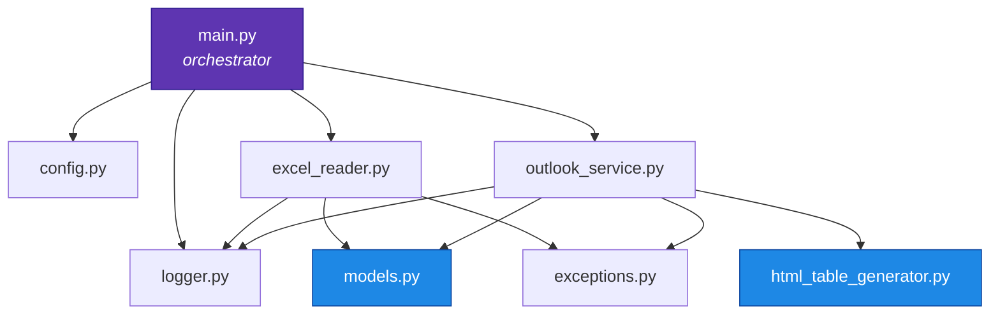
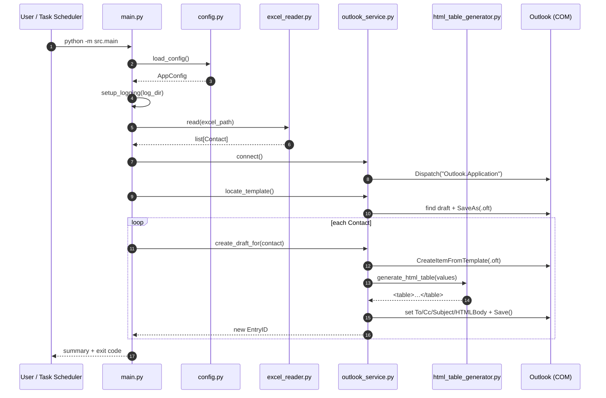
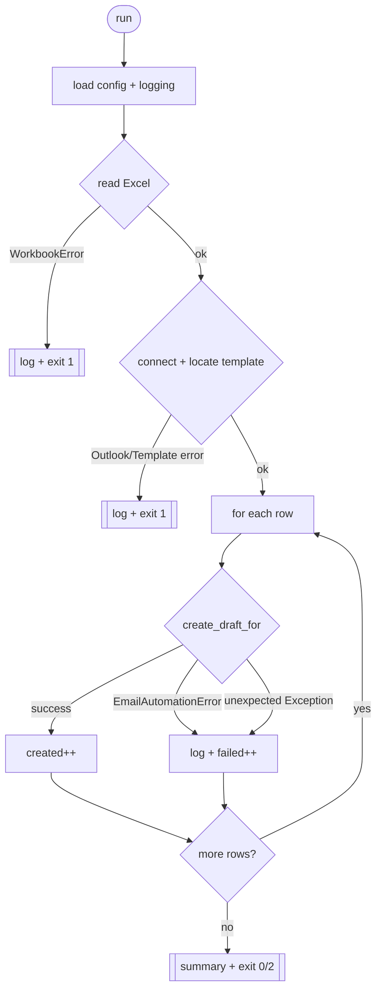

# Architecture

This page shows how the modules collaborate, the lifecycle of a single run, and
the design principles that shaped the project.

## Design principles

1. **One job per module.** Each file has a single responsibility, so it can be
   read, tested and changed in isolation. See the [Modules overview](modules/index.md).
2. **Template lives in Outlook, not in code.** Your formatting, images and
   signature come from a real draft — code only edits three fields.
3. **Fail safe, continue on row errors.** Setup problems stop the run; a single
   bad row is logged and skipped.
4. **Drafts only, always.** No `.Send()` anywhere.
5. **Configuration over hard-coding.** Everything tunable lives in
   [`config.py`](config.md) and can be overridden by environment variables.

## Module dependency map



- **Purple** = entry point.
- **Blue** = pure, dependency-light modules (easy to unit-test without Outlook).

!!! note "Why `models` and `html_table_generator` have no project dependencies"
    They are pure data/string logic. Keeping them free of Outlook/Excel imports
    means you can test them on any OS and reuse them anywhere.

## Lifecycle of a run



## Data transformation pipeline

How one spreadsheet row becomes a draft:

```mermaid
flowchart LR
    subgraph Excel
      R[("Row:<br/>514 | 1526 | … | note")]
    end
    R --> CT[Contact.values]
    CT -->|values[0]| TO[To = 514]
    CT -->|values[:7] joined| SUB[Subject]
    CT -->|all values| TAB[generate_html_table]
    TAB --> INS{{TABLE placeholder?}}
    INS -->|yes| REP[replace in body]
    INS -->|no| APP[insert before &lt;/body&gt;]
    REP & APP --> BODY[HTMLBody]
    TO & SUB & BODY --> SAVE[(Save draft)]
```

See the exact rules in the [Data contract](reference/data-contract.md).

## Error-handling strategy



| Exit code | Meaning |
| --- | --- |
| `0` | All rows succeeded |
| `1` | Fatal setup error (bad workbook, Outlook, or template) |
| `2` | Completed, but one or more rows failed |

Read the deeper rationale in [`main.py`](main.md) and [`exceptions.py`](exceptions.md).
