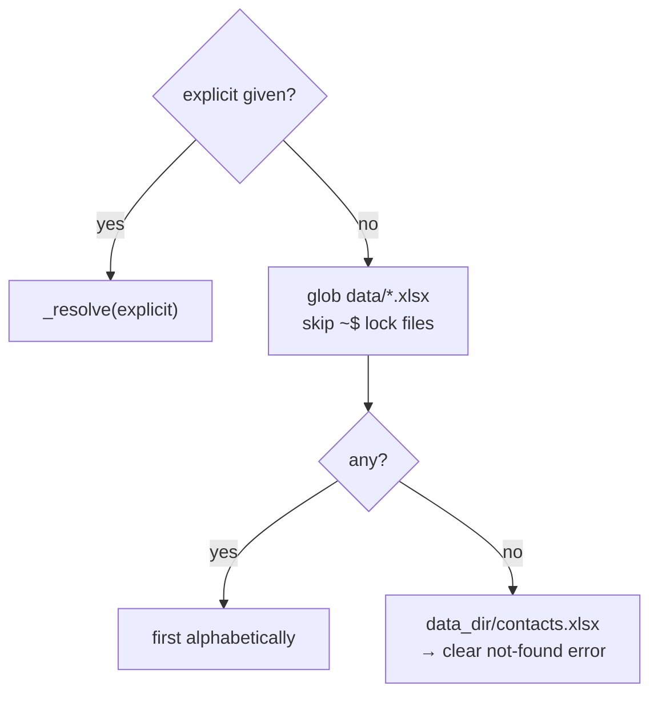

# `src/config.py` — Central configuration

!!! abstract "At a glance"
    **Responsibility:** be the single source of truth for every setting, resolve
    paths against the project root, and auto-discover the Excel file.
    **Depends on:** standard library only. **Pure:** yes.

## Why it exists

Every other module needs settings. Instead of scattering hard-coded values
(`"MASTER TEMPLATE"`, `data/contacts.xlsx`, `7`…) across the codebase, they live
in **one immutable object**. Change a setting here and the whole app follows.

## Public API

### `class AppConfig`

A `@dataclass(frozen=True)` holding all settings. Frozen = immutable, so no
module can change a setting at runtime (prevents a whole class of bugs) and you
get clean attribute access plus a free `repr`.

See the full field list in the [Configuration reference](reference/configuration.md#settings-table).

### `load_config() -> AppConfig`

Builds an `AppConfig` from defaults + environment variables.

```python
from src.config import load_config

cfg = load_config()
print(cfg.template_subject)   # "MASTER TEMPLATE"
print(cfg.excel_path)         # absolute path, auto-discovered
```

| Returns | Notes |
| --- | --- |
| `AppConfig` | Fully resolved; `excel_path` is absolute |

### `discover_excel(data_dir, explicit=None) -> Path`

Decides **which** workbook to read.

```python
discover_excel(Path("data"))                       # first *.xlsx in data/
discover_excel(Path("data"), "C:/x/June.xlsx")     # explicit wins
```



### `_resolve(path) -> Path` (internal)

Anchors a relative path to `PROJECT_ROOT`; leaves absolute paths untouched.

```python
PROJECT_ROOT = Path(__file__).resolve().parent.parent
# "data/contacts.xlsx" → C:\...\email-automation\data\contacts.xlsx
```

## Design decisions

??? note "Why environment variables with defaults?"
    Each setting can be overridden by an env var but works out of the box. Non
    technical use needs no setup; a different machine or run just sets a variable
    — no code edit, no redeploy.

??? note "Why anchor paths to the project root?"
    A relative path otherwise depends on the folder you launched from — a classic
    “file not found” when run via Task Scheduler (which starts in `System32`).
    Anchoring makes the app location-independent.

??? note "Why auto-discover the workbook?"
    So you can drop **any** `.xlsx` into `data/` without renaming it. Excel lock
    files (`~$…`) are skipped; if none exist, a clear error points at `data/`.

!!! safety "`never_send = True`"
    A hard-coded flag documenting the golden rule: this tool creates drafts only.

## See also

- [Configuration reference](reference/configuration.md) — every field + env var
- [Data contract](reference/data-contract.md) — how the file is read
- [`main.py`](main.md) — the first thing it calls is `load_config()`
