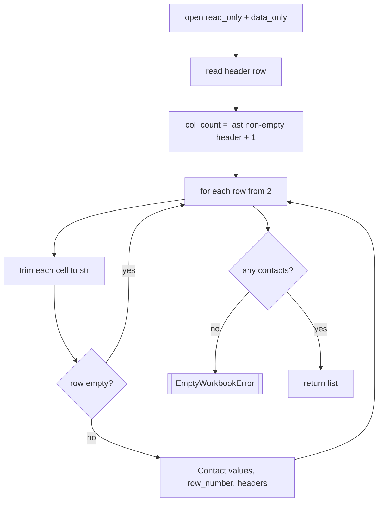

# `src/excel_reader.py` — Reading the spreadsheet

!!! abstract "At a glance"
    **Responsibility:** turn a messy `.xlsx` into clean `Contact` objects.
    **Depends on:** openpyxl, [`models`](models.md), [`exceptions`](exceptions.md),
    [`logger`](logger.md). **Pure:** no (does file I/O).

## Why it exists

This is the single boundary between “messy spreadsheet” and “clean Python
objects”. All the awkward parts — empty cells, whitespace, ragged rows — are
handled here so no other module has to care.

## Reference

### `class ExcelReader(path, sheet_name=None)`

| Param | Meaning |
| --- | --- |
| `path` | Path to the workbook |
| `sheet_name` | Optional sheet; defaults to the **first** worksheet |

#### `read() -> list[Contact]`

Opens the workbook, skips the header row, and returns one `Contact` per non-empty
data row.

```python
from pathlib import Path
from src.excel_reader import ExcelReader

contacts = ExcelReader(Path("data/contacts.xlsx")).read()
print(len(contacts), contacts[0].recipient)
```



**Raises:** `WorkbookError` (file missing), `EmptyWorkbookError` (no header / no
data) — both fatal.

#### Internal helpers

- `_clean(value) -> str` — `None` → `""`, otherwise `str(value).strip()`.
- `_last_non_empty_index(cells) -> int` — index of the last non-empty header,
  used to fix the row width.

## Design decisions

??? note "Why openpyxl and not pandas?"
    The project requirement is explicitly **no pandas**. openpyxl reads `.xlsx`
    natively with no heavy numeric dependencies — ideal for a locked-down PC.

??? note "Why `read_only=True, data_only=True`?"
    - `read_only` streams rows (fast, low memory, can't modify your file).
    - `data_only` returns a formula cell's **computed value** (`110`), not its
      formula text (`=A1*2`).

??? note "Why compute a fixed column count?"
    Taking the width from the last non-empty header means short rows are padded
    with `""` and trailing blank cells don't create stray empty `<td>`s later.

## Known gotcha: "only N rows were read"

In `read_only=True` mode, openpyxl trusts the worksheet's **declared dimension**
stored in the file. Some exporters (SAP, web tools, certain Excel/Outlook exports)
under-declare it, so `iter_rows` stops early.

!!! warning "Fix"
    Recompute the real range before iterating:
    ```python
    ws.reset_dimensions()   # forces openpyxl to rescan used cells
    ```
    or open with `read_only=False`. This is a property of the **source file**, not
    your data. See also the [Data contract note](reference/data-contract.md#notes-gotchas).

## See also

- [`models.py`](models.md) — the objects produced here
- [Data contract](reference/data-contract.md) — the interpretation rules
- [Troubleshooting](reference/troubleshooting.md)
