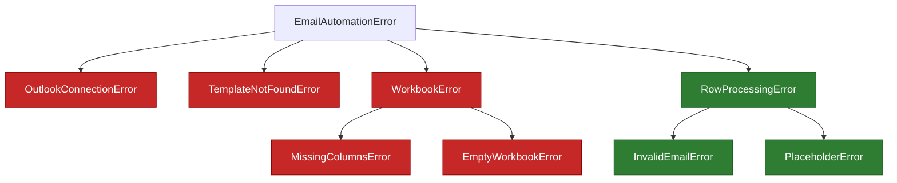

# `src/exceptions.py` — Custom error types

!!! abstract "At a glance"
    **Responsibility:** define a typed exception hierarchy so the app can tell
    **fatal** problems from **recoverable** per-row ones. **Depends on:** stdlib.
    **Pure:** yes.

## Why it exists

Different problems need different responses:

- *“Outlook isn't running”* → **fatal**, stop the run.
- *“This one row has a bad value”* → **recoverable**, skip it and continue.

Typed exceptions let the code distinguish these with `try/except` instead of
parsing error-message strings.

## The hierarchy



- **Red** = fatal (stop the run).
- **Green** = recoverable (log and continue).

## Reference

| Exception | Family | Raised when |
| --- | --- | --- |
| `EmailAutomationError` | base | (never directly) — catch-all for app errors |
| `OutlookConnectionError` | fatal | Outlook can't be reached/started |
| `TemplateNotFoundError` | fatal | No master draft by subject/EntryID |
| `WorkbookError` | fatal | Generic workbook problem (e.g. missing file) |
| `MissingColumnsError` | fatal | Required column absent |
| `EmptyWorkbookError` | fatal | No header / no data rows |
| `RowProcessingError` | recoverable | Base for single-row failures |
| `InvalidEmailError` | recoverable | Recipient invalid (reserved for validation) |
| `PlaceholderError` | recoverable | Placeholder substitution failed |

## How callers use it

```python
try:
    contacts = ExcelReader(cfg.excel_path).read()
except WorkbookError:          # whole family → stop
    return 1

for contact in contacts:
    try:
        service.create_draft_for(contact)
    except EmailAutomationError:  # row-level → log + continue
        failed += 1
```

??? note "Why keep currently-unused types (e.g. `InvalidEmailError`)?"
    They cost nothing and keep the door open for future features (preview mode,
    validation). The names *are* documentation in a log file.

## See also

- [`main.py`](main.md) — decides stop-vs-continue using these types
- [Architecture → error handling](architecture.md#error-handling-strategy)
