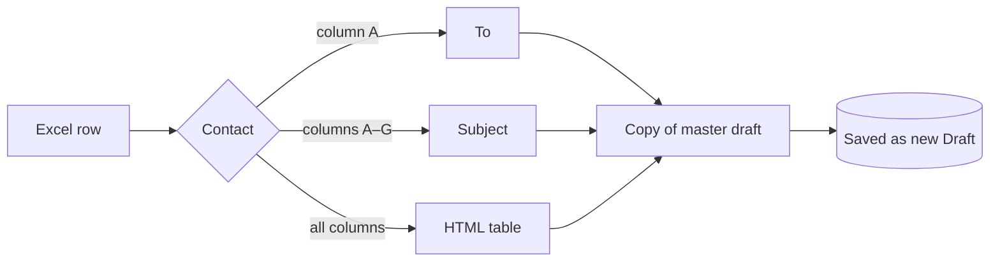

# Email Automation — Outlook Draft Generator

Turn each row of an Excel file into a personalized **Outlook draft**, built from
an existing **master template draft**. The original template is never changed,
and **email is never sent**.

!!! safety "The golden rule"
    This tool only ever calls `MailItem.Save()`. There is **no** `.Send()` call
    anywhere in the codebase. Every output lands in your **Drafts** folder for
    you to review.

## What you get

<div class="grid cards" markdown>

-   :material-file-excel: **Excel in**

    Reads any `.xlsx` in `data/` with openpyxl (no pandas). First row = headers.

-   :material-microsoft-outlook: **Drafts out**

    Duplicates your Outlook master draft per row, preserving fonts, images,
    hyperlinks and signature.

-   :material-table: **Dynamic tables**

    Generates a fresh HTML table from every column and inserts it at `{{TABLE}}`
    (or appends it).

-   :material-shield-check: **Safe by design**

    Drafts only. Original template untouched. One bad row never stops the batch.

</div>

## The 30-second mental model



Only **To**, **Cc**, **Subject** and the **table** change. Everything else is
inherited from the template copy.

## Where to go next

| If you want to… | Read |
| --- | --- |
| Understand how the pieces fit | [Architecture](architecture.md) |
| Read about a specific file | [Modules overview](modules/index.md) |
| Run it / schedule it | [Running & Automation](running-and-automation.md) |
| Know every setting | [Configuration reference](reference/configuration.md) |
| Lay out your spreadsheet | [Data contract](reference/data-contract.md) |
| Fix an error | [Troubleshooting](reference/troubleshooting.md) |
| Look up a term | [Glossary](reference/glossary.md) |

## Quick start

```powershell
# 1. install runtime deps
pip install -r requirements.txt

# 2. (optional) generate sample data
python scripts/make_sample_xlsx.py

# 3. run — creates drafts, never sends
python -m src.main
```

!!! tip "Reading these docs locally"
    ```powershell
    pip install -r requirements-docs.txt
    mkdocs serve
    ```
    Then open <http://127.0.0.1:8000>. The site rebuilds as you edit.
