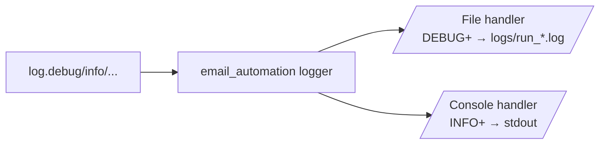

# `src/logger.py` — Logging setup

!!! abstract "At a glance"
    **Responsibility:** configure one app-wide logger that writes to **both** the
    console and a **timestamped file**. **Depends on:** standard library only.
    **Pure:** yes.

## Why it exists

The app runs unattended on a remote PC. When row 37 fails at 1 a.m. you need a
permanent record — `print()` vanishes, a log file does not. Logging also stamps
every line with time, level and source module automatically.

## Public API

### `setup_logging(log_dir, level=logging.DEBUG) -> None`

Call **once** at startup (from [`main.py`](main.md)). Creates `log_dir`, attaches
a file handler and a console handler.

```python
from pathlib import Path
from src.logger import setup_logging
setup_logging(Path("logs"))
```

| Param | Meaning |
| --- | --- |
| `log_dir` | Directory for log files (created if missing) |
| `level` | Minimum level for the **file** handler (default `DEBUG`) |

### `get_logger(name) -> logging.Logger`

Call in **every** module to get a child logger.

```python
from src.logger import get_logger
log = get_logger(__name__)
log.info("Outlook connected")
```

## How it routes messages



- **Console** stays readable (INFO+), so you see progress.
- **File** keeps everything (DEBUG+) for diagnosis.
- One **timestamped file per run** (`run_20260630_013426.log`) so runs never
  overwrite each other.

## Design decisions

??? note "Why guard against duplicate handlers?"
    ```python
    if root.handlers:
        return
    ```
    Without this, re-importing/re-calling would attach handlers repeatedly and
    every line would print two or three times.

??? note "Why a single `email_automation` namespace?"
    All loggers are children of one parent that owns the handlers. Every module's
    output flows to the same console+file, and you can silence or filter the whole
    app by that one name.

## Example output

```text
2026-06-30 01:34:26 [INFO    ] email_automation.main: === Email automation started ===
2026-06-30 01:34:26 [INFO    ] email_automation.src.excel_reader: Read 4 contact(s) from KOTC JUNE.xlsx
```

## See also

- [`main.py`](main.md) — calls `setup_logging` first
- [Troubleshooting](reference/troubleshooting.md) — start from the newest log
