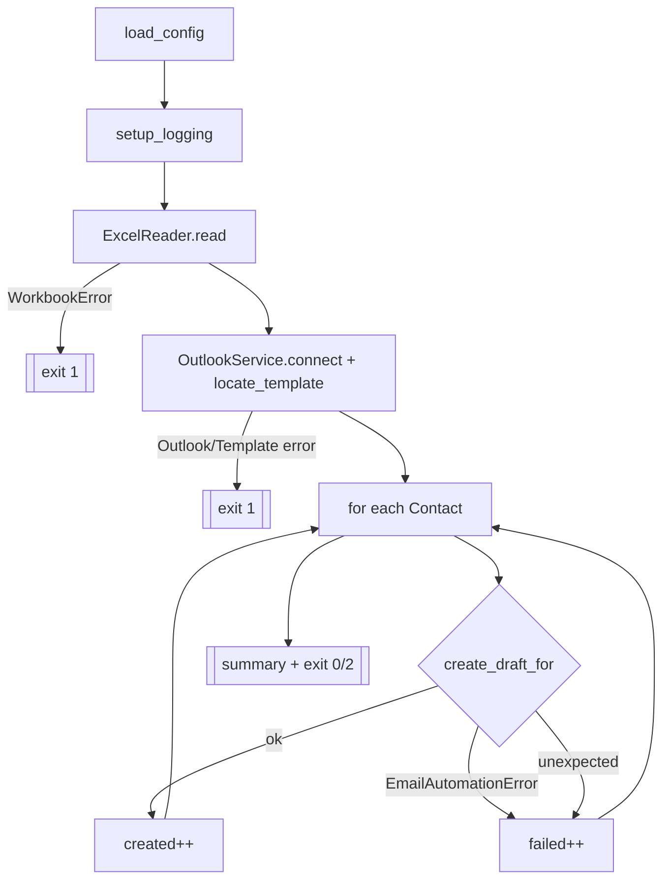

# `src/main.py` — The orchestrator

!!! abstract "At a glance"
    **Responsibility:** wire every module together in the right order and own the
    overall flow, error handling and exit code. **Depends on:** all modules.
    **Entry point:** `python -m src.main`.

## Why it exists

Each module does one job; **something** must call them in order and handle the
big picture. Keeping orchestration in one short function makes the whole program
readable top to bottom.

## Reference

### `run() -> int`

The entire program. Returns an exit code.



## Design decisions

??? note "Why this strict order?"
    Config and logging come first so everything afterward is configured and
    logged. Excel is read **before** touching Outlook, so a bad spreadsheet fails
    fast and cheap.

??? note "Why two layers of row error handling?"
    ```python
    except EmailAutomationError: failed += 1   # known, expected
    except Exception:            failed += 1   # surprise COM errors
    ```
    The extra `except Exception` ensures one weird row (e.g. an inline-response
    quirk) can never abort the whole batch — fulfilling “continue processing
    remaining rows”.

## Exit codes

| Code | Meaning | Task Scheduler reads it as |
| --- | --- | --- |
| `0` | All rows succeeded | success |
| `1` | Fatal setup error (workbook/Outlook/template) | failure |
| `2` | Finished, but some rows failed | partial |

## Reading a run

```text
=== Email automation started (DRAFTS ONLY — never sends) ===
Using workbook: ...\data\KOTC JUNE.xlsx
Read 4 contact(s) ...
Outlook connected
Template located by subject: 'MASTER TEMPLATE'
Draft created for '514' (row 2) -> EntryID ...
=== Summary: 4 draft(s) created, 0 failed, 4 total ===
```

Each line maps to a step in the diagram above.

## See also

- [Architecture](architecture.md) — full run lifecycle
- [`exceptions.py`](exceptions.md) — the types that drive stop-vs-continue
- [Running & Automation](running-and-automation.md)
