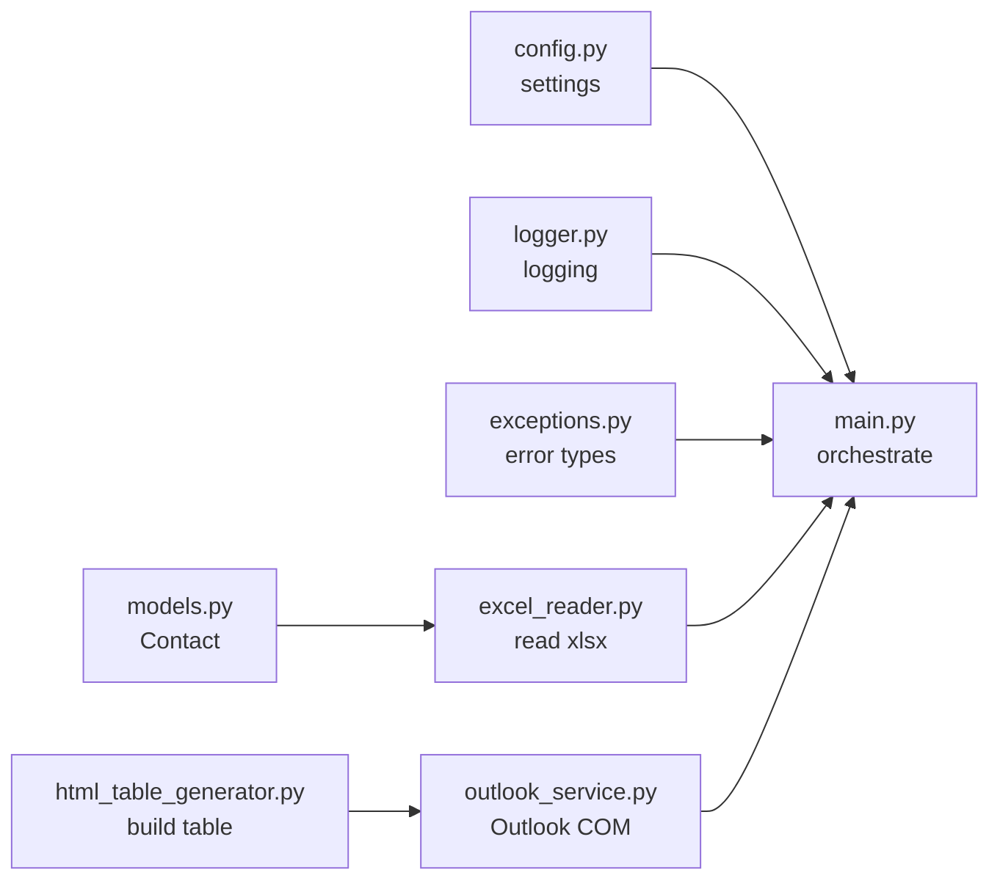

# Modules overview

The application package is `src/`. Each module has one responsibility. This page
is a map; click through for per-function detail, diagrams and examples.

## At a glance

| Module | Responsibility | Depends on | Pure?[^pure] |
| --- | --- | --- | --- |
| [config.py](../config.md) | Central settings + path/workbook resolution | stdlib | ✅ |
| [logger.py](../logger.md) | Console + file logging | stdlib | ✅ |
| [exceptions.py](../exceptions.md) | Typed error hierarchy | stdlib | ✅ |
| [models.py](../models.md) | The `Contact` row model | stdlib | ✅ |
| [excel_reader.py](../excel_reader.md) | Read `.xlsx` → `Contact`s | openpyxl, models, exceptions, logger | ⚠️ I/O |
| [html_table_generator.py](../html_table_generator.md) | Row → HTML `<table>` | stdlib | ✅ |
| [outlook_service.py](../outlook_service.md) | Drive Outlook, build drafts | pywin32, html gen, models, exceptions, logger | ❌ COM |
| [main.py](../main.md) | Wire it all together | all of the above | ❌ |

[^pure]:
    "Pure" here means no side effects and no heavy/OS-specific dependencies, so
    the module can be imported and unit-tested anywhere. `excel_reader` does file
    I/O; `outlook_service` needs Windows + Outlook.

## Reading order for newcomers

1. [models.py](../models.md) — the shape of the data (`Contact`).
2. [excel_reader.py](../excel_reader.md) — where `Contact`s come from.
3. [html_table_generator.py](../html_table_generator.md) — the table logic.
4. [outlook_service.py](../outlook_service.md) — how drafts are built.
5. [main.py](../main.md) — how a run is orchestrated.
6. [config.py](../config.md), [logger.py](../logger.md),
   [exceptions.py](../exceptions.md) — the cross-cutting support modules.

## Conventions used across modules

- **Logging:** every module gets its logger via `get_logger(__name__)`; only
  `main.py` calls `setup_logging`.
- **Errors:** raise a typed error from [exceptions.py](../exceptions.md); let
  `main.py` decide stop-vs-continue.
- **Typing & docstrings:** public functions are type-hinted and documented.
- **No hidden config:** anything tunable comes from
  [`AppConfig`](../reference/configuration.md), not constants scattered in code.
