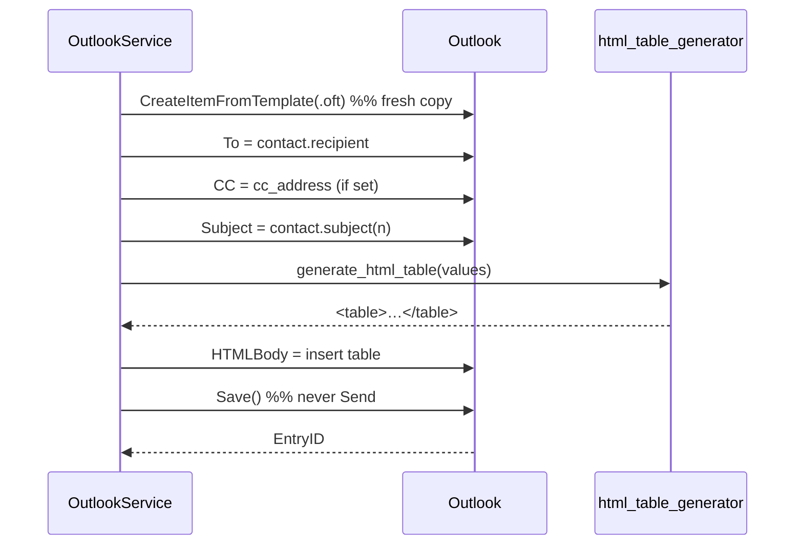

# `src/outlook_service.py` — Talking to Outlook

!!! abstract "At a glance"
    **Responsibility:** drive the Outlook desktop app via pywin32 COM — connect,
    find the template, and build a new draft per row. **Depends on:** pywin32,
    [`html_table_generator`](html_table_generator.md), [`models`](models.md),
    [`exceptions`](exceptions.md), [`logger`](logger.md). **Pure:** no (Windows +
    Outlook).

!!! safety "Never sends"
    Only `MailItem.Save()` is called. There is no `.Send()` anywhere.

## Why it exists

All Windows/COM/Outlook complexity lives here behind a small interface
(`connect`, `locate_template`, `create_draft_for`). The rest of the app knows
nothing about COM — so a future Microsoft Graph or Gmail backend would just be a
new service.

## Reference

### `OutlookService(template_subject, template_entryid=None, subject_columns=7, table_placeholder="{{TABLE}}", cc_address="")`

| Param | Meaning |
| --- | --- |
| `template_subject` | Subject used to locate the master draft |
| `template_entryid` | Optional exact EntryID (wins over subject) |
| `subject_columns` | Leading columns joined into the subject |
| `table_placeholder` | Token replaced by the table; appended if absent |
| `cc_address` | Fixed Cc on every draft (`;`-separated); empty = leave as-is |

#### `connect() -> None`

Dispatches `Outlook.Application` and gets the MAPI namespace. Imports `win32com`
**lazily** so the module imports on any OS for testing the non-COM logic.

**Raises:** `OutlookConnectionError`.

#### `locate_template() -> MailItem`

Finds the master draft by EntryID or by scanning Drafts for the subject, then
caches it as a `.oft`. **Raises:** `TemplateNotFoundError`.

#### `create_draft_for(contact) -> str`

The core operation. Returns the new draft's EntryID.



#### Internal helpers

- `_cache_template_as_oft()` — `SaveAs(path, olTemplate)` once, so drafts are made
  from a template instead of `Copy()`.
- `_new_from_template()` — `CreateItemFromTemplate(.oft)`, falling back to
  `template.Copy()`.
- `_insert_table(html_body, table_html)` — replace `{{TABLE}}` or insert before
  `</body>`.

## Design decisions

??? note "Why lazy-import `win32com`?"
    Putting the import inside `connect()` lets the module be imported and
    unit-tested on any OS (e.g. the table/insert logic) without pywin32 installed.

### Duplicating via an `.oft` template — the key robustness fix

```python
self._template.SaveAs(path, OL_SAVE_AS_TEMPLATE)   # cache once
...
self._app.CreateItemFromTemplate(self._oft_path)    # fresh copy per row
```

!!! warning "Why not just `template.Copy()`?"
    If the master draft was created via **Reply/Forward**, Outlook marks it an
    *inline response item* and `Copy()` fails with *“This method can't be used with
    an inline response mail item.”* Saving the template as a `.oft` and creating
    each draft from it sidesteps that **and** preserves fonts, images, hyperlinks
    and the signature. If the `.oft` save fails, it falls back to `Copy()`.

### Only three things change per row

`To`, `Cc`, `Subject` and the `{{TABLE}}` content. Everything else comes untouched
from the template copy — satisfying the “preserve formatting” requirement.

### Table insertion: placeholder or append

```python
if self.table_placeholder in body:
    return body.replace(self.table_placeholder, table_html)
idx = body.lower().rfind("</body>")
return body[:idx] + table_html + body[idx:]
```

## Outlook constants

| Constant | Value | Meaning |
| --- | --- | --- |
| `OL_FOLDER_DRAFTS` | 16 | The Drafts default folder |
| `OL_SAVE_AS_TEMPLATE` | 2 | Save a mail item as a `.oft` template |

## See also

- [Running & Automation](running-and-automation.md) — why COM needs an
  interactive local session
- [Troubleshooting](reference/troubleshooting.md) — the inline-response and
  template-not-found errors
