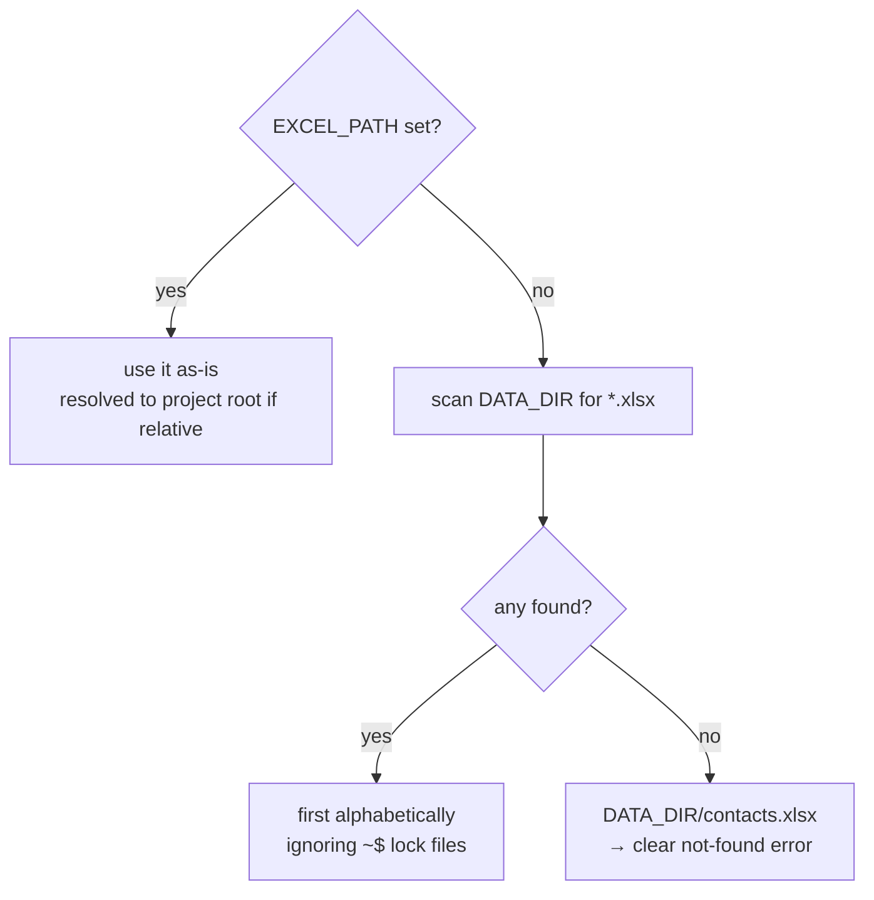

# Configuration reference

Every setting lives in [`AppConfig`](../config.md) and is produced by
`load_config()`. Each has a sensible default and an optional environment-variable
override — no code edits required.

## Settings table

| Field (`AppConfig`) | Env var | Default | Type | Purpose |
| --- | --- | --- | --- | --- |
| `template_subject` | `TEMPLATE_SUBJECT` | `MASTER TEMPLATE` | str | Subject used to find the master draft |
| `excel_path` | `EXCEL_PATH` | *auto-discovered* | Path | Exact workbook to read (overrides discovery) |
| `data_dir` | `DATA_DIR` | `data/` | Path | Folder scanned for an `.xlsx` |
| `log_dir` | `LOG_DIR` | `logs/` | Path | Where per-run log files are written |
| `drafts_folder` | `DRAFTS_FOLDER` | `Drafts` | str | Reserved/informational folder name |
| `outlook_entryid` | `TEMPLATE_ENTRYID` | *(unset)* | str? | Pin the template by exact EntryID |
| `subject_columns` | `SUBJECT_COLUMNS` | `7` | int | How many leading columns form the subject |
| `table_placeholder` | `TABLE_PLACEHOLDER` | `{{TABLE}}` | str | Token replaced by the generated table |
| `cc_address` | `CC_ADDRESS` | *(empty)* | str | Fixed Cc on every draft (`;`-separated) |
| `never_send` | — | `True` | bool | Hard-coded safety flag (drafts only) |

## Precedence rules



## Setting variables on Windows

=== "Current session only"

    ```powershell
    $env:TEMPLATE_SUBJECT = "JUNE TEMPLATE"
    $env:CC_ADDRESS = "boss@company.com; team@company.com"
    python -m src.main
    ```

=== "Persist for your user"

    ```powershell
    [Environment]::SetEnvironmentVariable("CC_ADDRESS", "boss@company.com", "User")
    # open a new terminal to pick it up
    ```

=== "Point at a specific file"

    ```powershell
    $env:EXCEL_PATH = "C:\full\path\to\KOTC JUNE.xlsx"
    python -m src.main
    ```

## Path resolution

Relative paths are anchored to the **project root** (the folder containing
`src/`), not your current working directory:

```python
PROJECT_ROOT = Path(__file__).resolve().parent.parent
# data/contacts.xlsx → C:\...\email-automation\data\contacts.xlsx
```

This is why the app works the same whether you launch it from the project folder,
from `System32` (Task Scheduler), or anywhere else.

!!! warning "Multiple workbooks in `data/`"
    Auto-discovery picks the **first file alphabetically**. If you keep more than
    one `.xlsx` there, set `EXCEL_PATH` to choose explicitly.

See also: [`config.py` explained](../config.md) ·
[Data contract](data-contract.md) · [Troubleshooting](troubleshooting.md).
