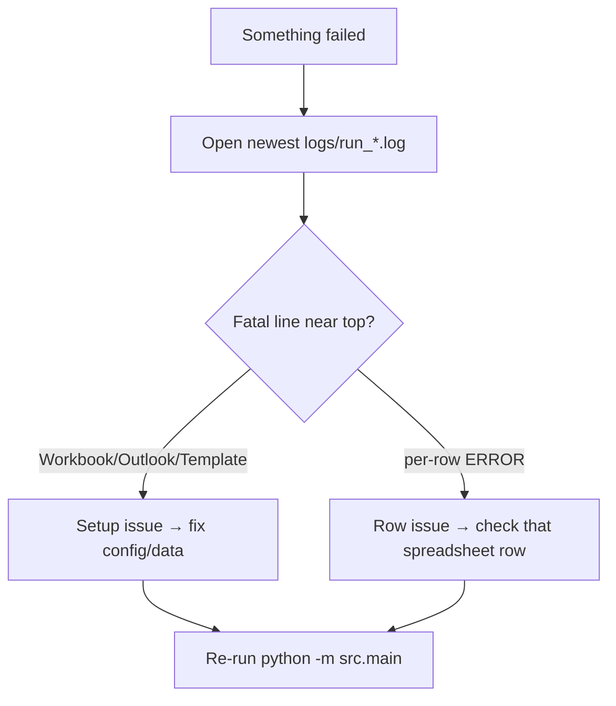

# Troubleshooting

Common errors, what they mean, and how to fix them. Each entry maps to a real log
message.

## `Workbook not found: data\contacts.xlsx`

**Cause:** no `.xlsx` in `data/`, or you ran from a folder without one.

**Fix:**

```powershell
Test-Path .\data\*.xlsx        # should list your file
```

- Drop your `.xlsx` into `data/` (any name works — see
  [auto-discovery](configuration.md#precedence-rules)).
- Or point at it explicitly: `$env:EXCEL_PATH = "C:\path\file.xlsx"`.

!!! info "Cloned the repo?"
    `.gitignore` excludes `data/*.xlsx`, so your real file is **not** cloned. Copy
    it onto the machine manually.

## `Could not connect to Outlook: … Invalid class string`

**Cause:** Outlook desktop isn't installed/registered on this machine (e.g. a dev
box without Outlook).

**Fix:** run on the Windows PC where Outlook is installed and signed in. COM only
works locally — see [Running & Automation](../running-and-automation.md).

## `This method can't be used with an inline response mail item`

**Cause:** the master draft was created via **Reply/Forward**, so Outlook blocks
`MailItem.Copy()`.

**Fix:** already handled in code — the template is cached as a `.oft` and drafts
are made with `CreateItemFromTemplate`. For the cleanest result, recreate
`MASTER TEMPLATE` using **New Email**. Background in
[`outlook_service.py`](../outlook_service.md#duplicating-via-an-oft-template-the-key-robustness-fix).

## `No draft found with subject 'MASTER TEMPLATE'`

**Cause:** no Drafts item has that exact subject (typos/extra spaces count).

**Fix:**

- Confirm the draft is in **Drafts** and the subject matches exactly.
- Or set `TEMPLATE_SUBJECT` to your actual subject, or pin by
  `TEMPLATE_ENTRYID`.

## Only some rows were processed

See [the dimension gotcha](data-contract.md#notes-gotchas) — the source file
under-declares its used range. Recompute with `reset_dimensions()`.

## Drafts created but the table is in the wrong place

**Cause:** the template has no `{{TABLE}}` placeholder, so the table is appended
before `</body>`.

**Fix:** add `{{TABLE}}` to the draft body exactly where you want the table, or
change `TABLE_PLACEHOLDER`.

## Scheduled task does nothing / fails silently

**Cause:** the task runs without an interactive session (Outlook COM needs one).

**Fix:** configure the task to run **only when the user is logged on**,
interactive — never as `SYSTEM`. See
[Running & Automation](../running-and-automation.md#why-automation-uses-rdp-task-scheduler-not-remote-calls).

## Where to look first



Every run writes a timestamped file under `logs/`; the **last** lines contain the
summary (`created / failed / total`).
